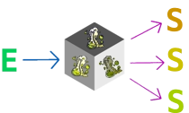

# reactor

Reactive state manager based on Flutter Bloc library

    

## What?

For the last couple of months I've been working on web frontend projects (primarily with Svelte),
and been struggling to find a state manager to clearly separates domain/application logic from UI.

One of the solutions I've worked with that achieves it is the [bloc library](https://bloclibrary.dev/). I like it for
three main reasons:

- it's declarative
- provides a clean API
- segregates UI actions and updates in two basic elements: events and state

The bloc library was developed for Flutter and it's internals, and not considering JS frameworks such as Svelte or
React. I couldn't find a complete port of the library, so I've decided to port in different frameworks that I work with,
by maintaining the library API and goals, but stripping down everything that I feel is not needed.

Since this library is a semi-port of the bloc library, it wouldn't be fair to maintain the original name (bloc). The
name **reactor** is inspired by the library mechanics of reacting to events to mapping them as states to then reacting
to each state on the UI.

## How to use

Currently, the library is available on the following frameworks. For a quick-start on how to use each library, visit
their `README.md`:

- [Svelte](packages/reactor-svelte/README.md)

---

## Bugs and Contributions

Found any bug (including typos) in the package? Do you have any suggestion
or feature to include for future releases? Please create an issue via
GitHub in order to track each contribution. Also, pull requests are very
welcome!
